# How to use DMMFastLauncher

## 1. Install

- Go to https://github.com/fa0311/DMMGamePlayerFastLauncher/releases/latest
- Download the setup.exe
- Run and install

## 2. Config

- Open your dmmgameplayer
- Login

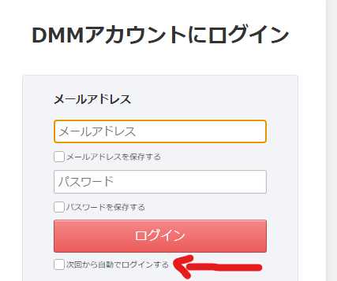

> 📝 I found it helpful to enable the remember account option (the one with arrow pointed to in the picture)

- Close your dmmgameplayer and open fast launcher
- Go to Account
  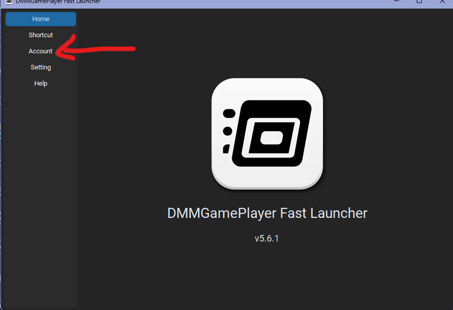
- Input the name of the account you want to import and press import
  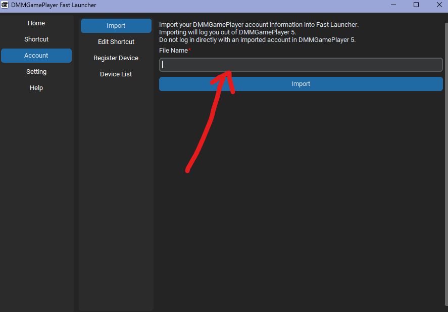
- Go to shortcut tab > create shortcut
  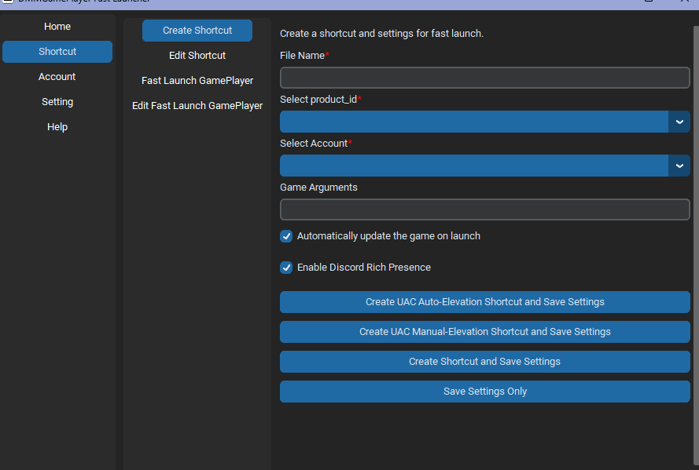
- Input all the information required
  - Input the filename
  - Select product id (should be priconner)
  - Select account (the one you just imported)
  - Click Auto-Elevation Shortcut (since prc require administrator)
    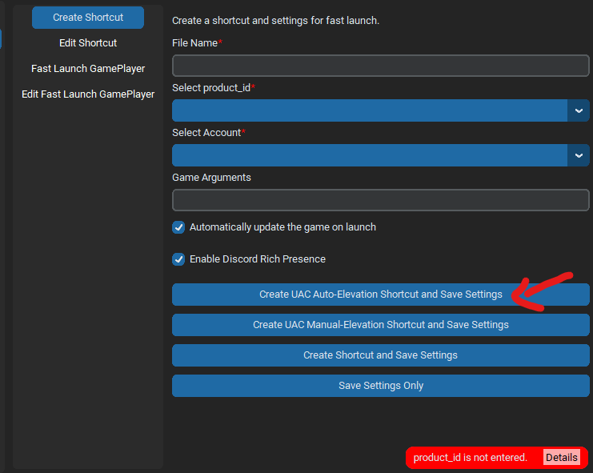
- You should see a shortcut in your desktop, like this
  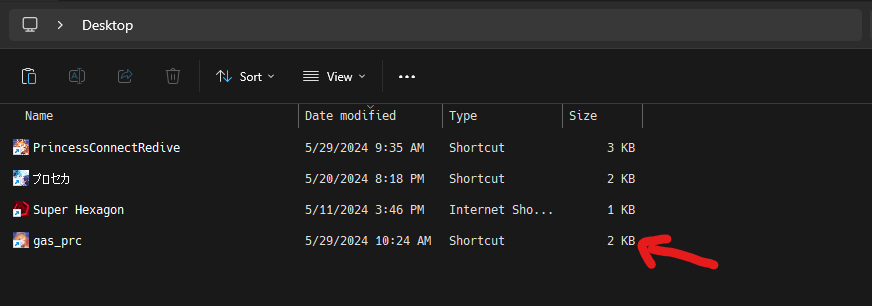

> 📝 In case your icon is not prc, please redo like this

- Go to account tab > edit shortcut > pick your shortcut > scroll down > delete
  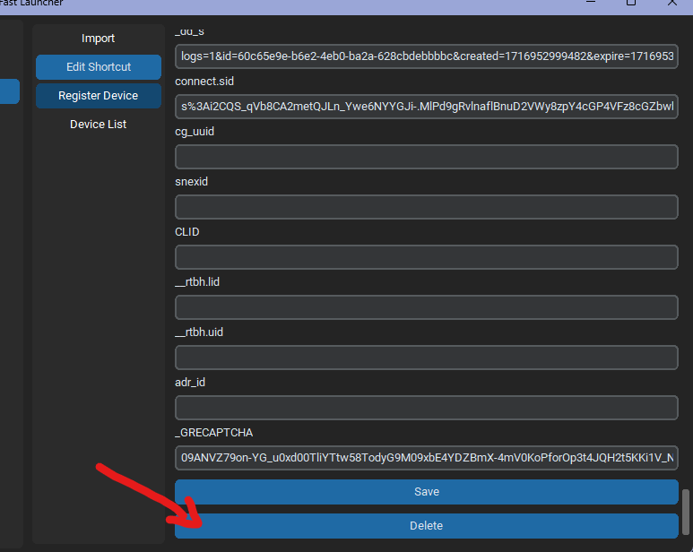
- Redo from the start (I'm not sure why I got this a lot before but the remember account option help)

## 3. Extra

#### If you want to open your account like this

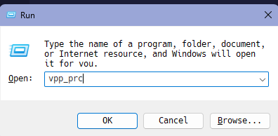

- Create a folder, I normally do C:/misc
- Go to edit environment variable
  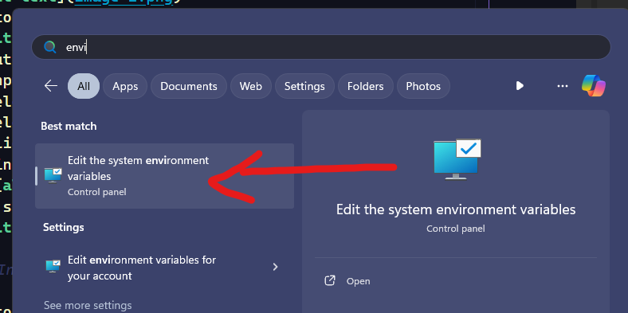
- Environments Variables...
  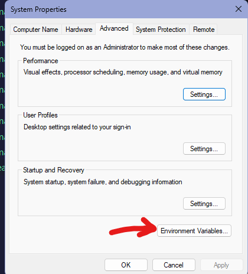
- Find one with name like PATH
  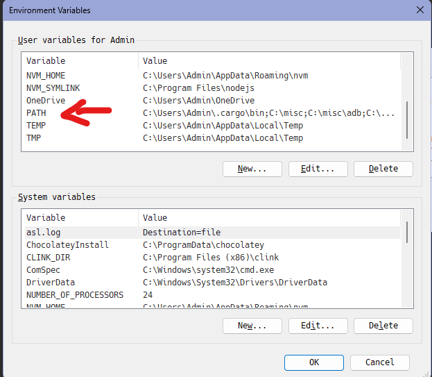
- Double click on it > Browse > select your folder  
  should see it appeared like this
  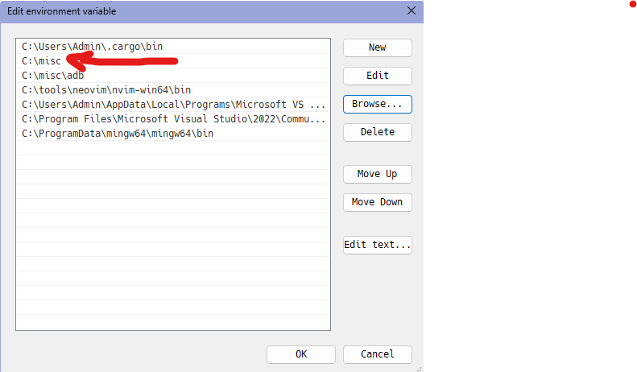
- Now everything you put into C:/misc will be executable by the system. So just put your shortcut in there. Everytime you want to run the shortcut just win + r > type the shortcut > enter
